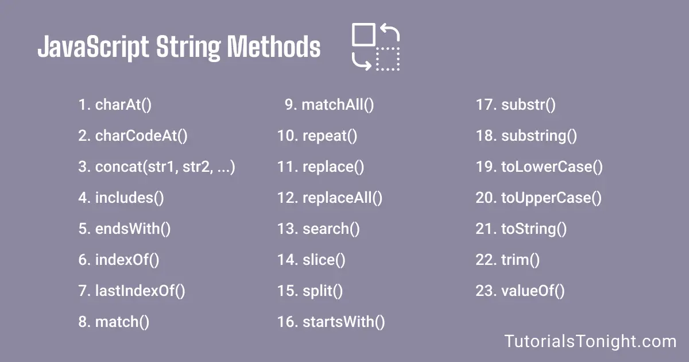

# String in Java Script

#### three method in Java Script

# String has method 

   

###  CharAt() method

### Concat() method

### Replace() method 

### ReplaceAll() method 

### Slit() method 

### Substring() method

### Slice(start,end) method 

### toUppercase method

### tolowercase method

### Trim() method 

### Includes() method 

### IndexOf() method 

###  Reapet() method 

### At() method 

# Method Number in JS

* max 
* min
* Floor
* round
* ceil 
* pow
* sqrt
* abs
 
 ### floor() method 

### Random() method 

 

\

### Ceil() method 

### Max() method 

### Min() method 

### Pow() method 

### Sqtr() method 

### Abs() method 

 ### Is NaN() method

